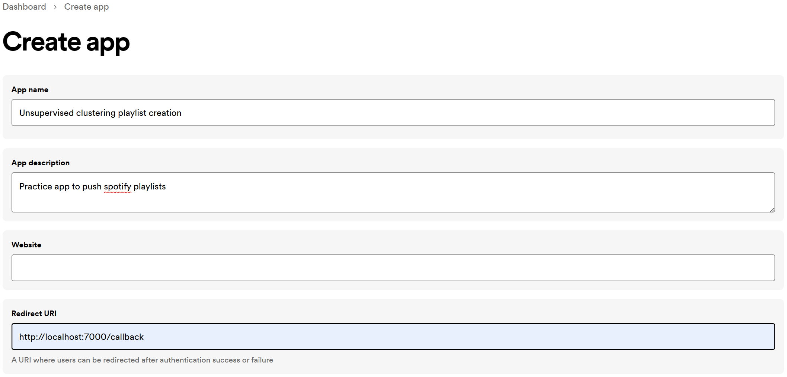

# unsupervised clustering spotify music
This github is part of the data science bootcamp at WBS. The project goal was to cluster 5K+ songs unsupervised using song features.

## 1. setting up repository locally
setting up your environment variables
please start with making a copy of the .env-dist file and rename it to .env. Inside the created .env file please add your required information.

### 1.1 install dependencies
It's recommended to create a new virtualenv or conda environment and install the required packages inside that environment.

To install the required packages please run:

```bash
pip install -r requirements.txt
```

### 1.1 Getting Started with Spotify
First, navigate to [Spotify's Developer Website](https://developer.spotify.com/), register, and click the `Create app` button. Enter an app name, description, and Redirect URI.




> **Add the redirect URI to your .env file**

### 1.2 Getting the Client ID and Client Secret

From the dashboard of your new app, navigate to Settings and copy the Client ID and Client Secret.
> **Add the client id and secret to your .env file**

### 1.3 Getting the Username
To get your username go to (https://open.spotify.com/), not the developer site, and click the profile icon in the upper right to **get our Username**.
 > **Add the user name to your .env file**

## 2. clustering notebooks
The repository contains four notebooks. Three, bisect_kmeans_..., hdbscan_... and kmeans_... are notebooks that were used to analyze the clustering performance using different scalers and with or without data normalization. 

In the forth notebook, clustering_spotify_songs I use the bisect_kmeans_ with "best performing" settings, cluster the 5k+ songs into 25 clusters and creating Spotify playlists with 5 sample songs to listen how well the clustering was done.
